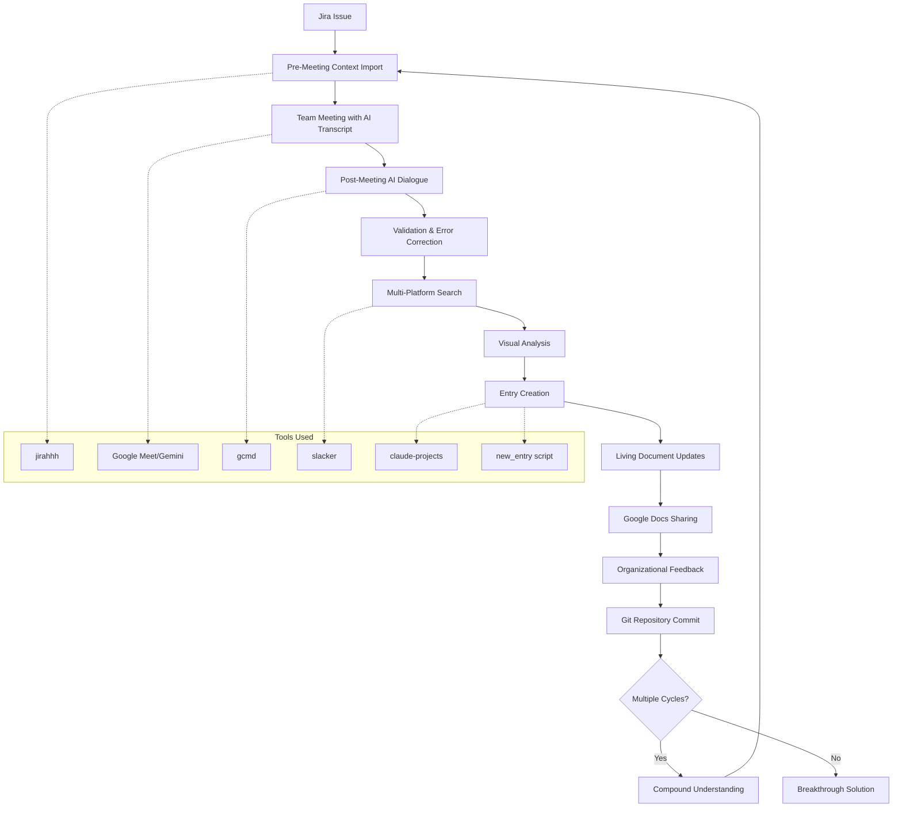
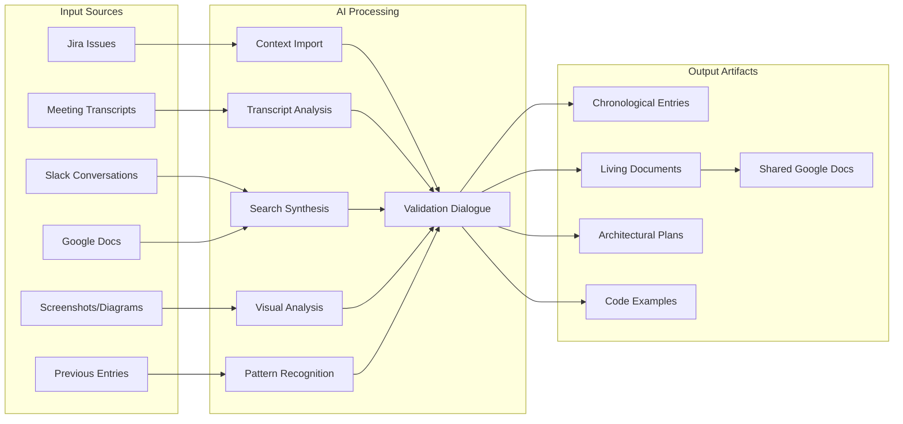
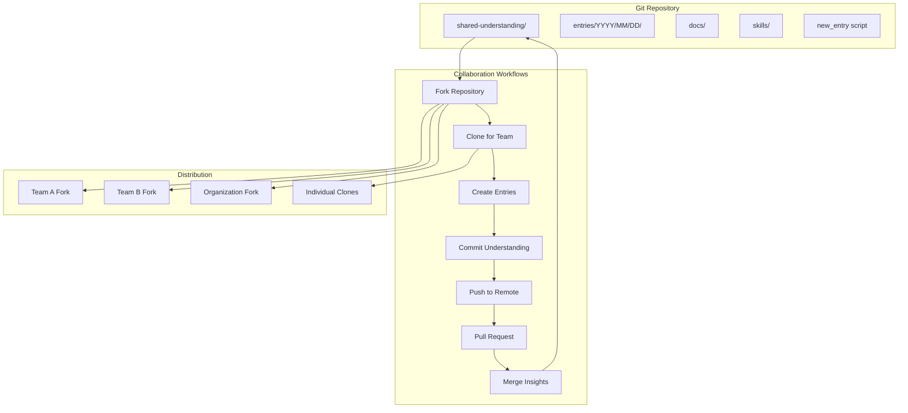
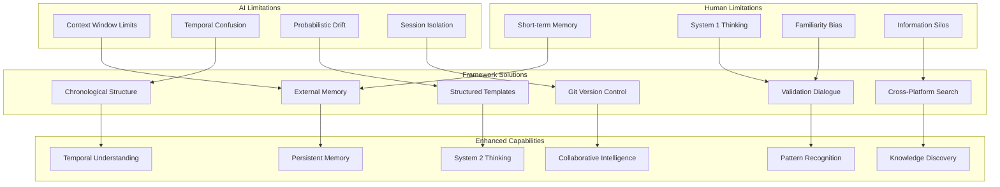
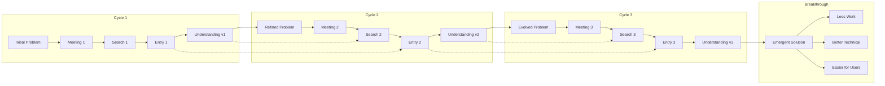
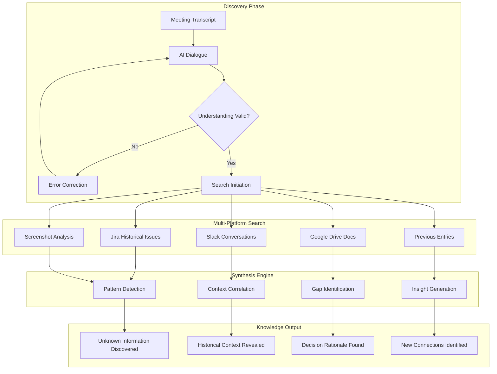
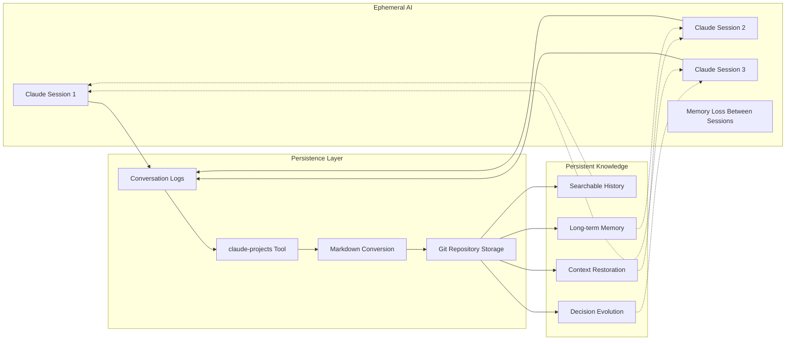
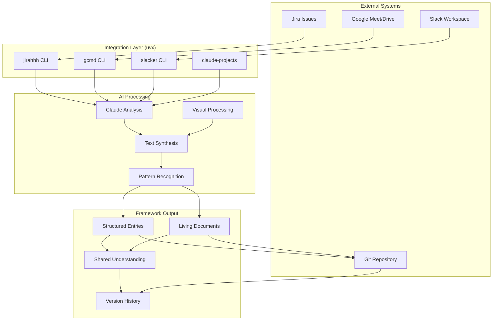
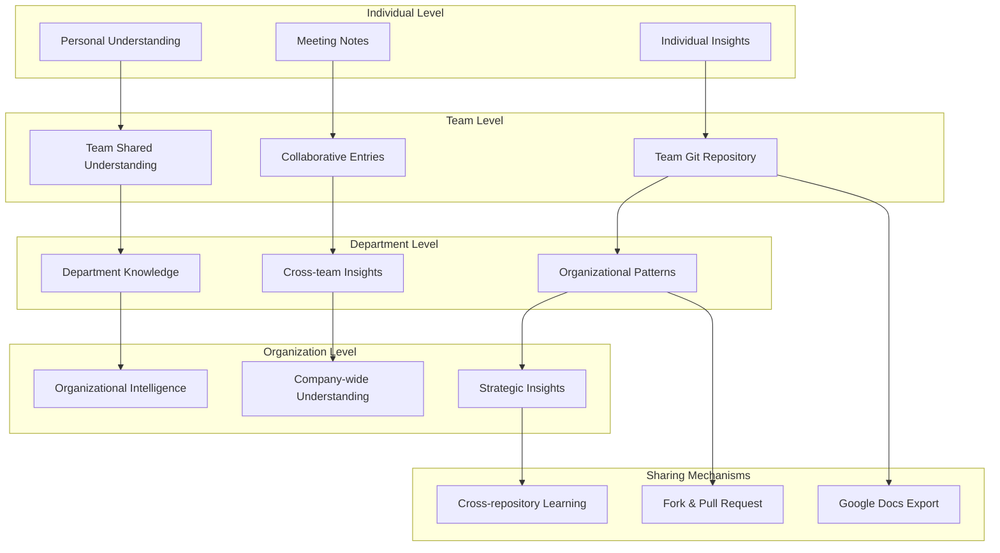

# Shared Understanding Framework: Workflow Diagrams

This document contains mermaid diagrams illustrating the shared understanding framework workflow, data flow, and architecture.

## Complete Workflow Overview

## Information Sources and Synthesis

## Git Repository Structure and Collaboration

## Cognitive Enhancement Flow

## Multi-Cycle Compound Understanding

## Knowledge Discovery Architecture

## Memory Persistence System

## Tools Integration Ecosystem

## Organizational Scaling Pattern

---

## How to Use These Diagrams

### **For Presentations:**
Copy the mermaid code blocks and paste into tools like:
- Mermaid Live Editor (https://mermaid.live)
- GitHub/GitLab markdown rendering
- VS Code with mermaid preview extension
- Draw.io with mermaid plugin

### **For Documentation:**
These diagrams can be embedded in:
- README files
- Technical documentation
- Process guides
- Training materials

### **For Analysis:**
Use these diagrams to:
- Identify workflow bottlenecks
- Optimize information flow
- Plan tool integrations
- Design organizational rollout

---

*Note: These diagrams illustrate the shared understanding framework as implemented across multiple real-world projects. The visual analysis mentioned throughout includes AI's surprisingly good ability to understand screenshots and technical diagrams, extending the framework beyond text-only processing.*